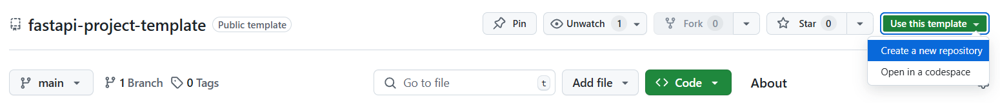
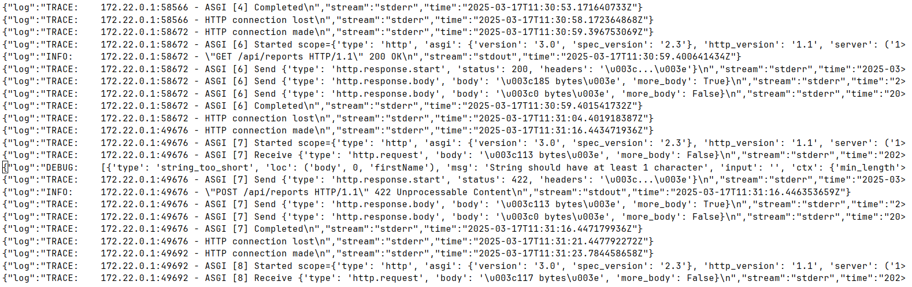

## Table of contents
- [Introduction](#introduction)
    - [Why this template is needed by community](#why-this-template-is-needed-by-community)
    - [What is not covered and why](#what-is-not-covered-and-why)
- [Getting started](#getting-started)
    - [Out of the box usage](#out-of-the-box-usage)
    - [Local development](#local-development)
- [Documentation](#documentation)
    - [Source code](#source-code)
        - [Main](#main)
        - [Settings](#settings)
        - [Middlewares](#middlewares)
        - [Errors](#errors)
        - [Schemas](#schemas)
        - [Models](#models)
        - [Dependencies](#dependencies)
        - [Data access layer](#data-access-layer)
        - [Sub-applications](#sub-applications)
    - [Tests](#tests)
    - [Containerization](#containerization)
- [Conclusion](#conclusion)

## Introduction
### Why this template is needed by community
Templates are important. They allow us not only to reduce the amount of boilerplate code we need to write from project
to project (especially in microframeworks like FastAPI), but also to compare the **approaches and thinking of different
developers**. Understanding this, I analyzed many of them and came to the conclusion that I should provide the community
with my (_humble_) opinion on what a universal template should be. I tried to:
* find **a middle ground between the simplicity and immediacy of the code and the capabilities of abstraction layers**.
 Some projects limit the _business logic layer_ to one file, while others actively use _DDD_. I think the balance is
 somewhere in the middle;
* **make examples minimalistic and unrelated to a specific real task**, so that we do not get distracted from the 
 _concept itself_. At the same time, understanding them, you can write the ones you need by analogy;
* to show **not so popular but useful features** that I discovered in _FastAPI, Pydantic and Docker_;
* to provide each interesting point with _detailed documentation_, so that you can consider this README as a 
 _template and best practices_ bundled together or even **a small handbook**.

### What is not covered and why
1. _ORM_ — the main storage implementation is written in **raw SQL (asyncpg)**, since most of the templates use _ORM_,
which is sometimes redundant. This is relevant in the context of some developers who are unhappy with relational mappers
and are going back to their roots;
2. Dependencies — many of the aspects mentioned here can be simplified by using _ready-made libraries_, but as I already
mentioned, the goal was to create **a universal and lightweight template**;
3. Full deployment cycle — this template is mostly about **architecture and code**.

## Getting started
### Out of the box usage
The easiest way to start a new project based on this template is to create a new repository via the _GitHub GUI_: click
the green «Use this template» button and select the **«Create a new repository»** option.



After cloning the repository to your local machine, you need to create a **.env** file in the root of the project using
the **.env.template**. Next, check for the latest version of **Docker** (I strongly recommend using the [official
instructions](https://docs.docker.com/engine/install/ "Docker documentation")).

The best practice is to test the project before each deployment - let's do this:

```sh
docker compose --profile test up
```

> In a real project, do not proceed to the next steps if some tests fails, this can result in serious
> errors, including _silent_ ones (for example, **security holes** that will be invisible to you, but which can
> be used by attackers).

Once all checks are passed, edit **.env** again (if necessary) and run the most important command:

```sh
docker compose --profile prod up
```

Leave the current terminal open to be able to monitor logs in real time, create a new one and apply the **DB
migrations** in it.

```sh
docker exec <web container name> -it sh
yoyo apply --database "$DB_SCHEMA"://"$DB_USER":"$DB_PASSWORD"@"$DB_HOST"/"$DB_NAME" src/db/migrations
```

> In a prod environment (as opposed to dev and test), it is recommended to apply migrations _manually_ as this is a very
> responsible action.

Your project should now be accessible at **http://localhost** on the specified port.

### Local development
Make sure you have a compatible version of Python specified in **pyproject.toml**. Then check for the latest version of 
**uv** ([installation docs](https://docs.astral.sh/uv/getting-started/installation/ "uv documentation")) and 
synchronize the dependencies.

```sh
uv sync
uv sync --group dev
```

Additionally, you can install **Hadolint** to lint Dockerfiles.

```sh
wget -O hadolint https://github.com/hadolint/hadolint/releases/download/<version>/<platform>

chmod +x hadolint
sudo mv hadolint /usr/local/bin/hadolint
```

## Documentation
### Source code
The application structure is a **layered architecture** divided into «sub-applications», which are somewhat similar to
_domains_, but have less strict rules of formation compared to domains from DDD. This division is inspired by _Django_,
where a «project» can have several **MVPs**, called «applications».

#### Main
Here all components (routers, error handlers, and middleware) are assembled. I prefer to explicitly manage their
addition, because it improves the flexibility of the code.

An _«api»_ prefix is added to each router, which can be useful if your backend also provides static data or generates
ready-made HTML pages: they can be placed in separate prefixes. This approach has good compatibility with **Nginx** and
other proxy servers.

#### Settings
Logging is the part where you need to write quite a lot of boilerplate code, so I prefer to use the **built-in Uvicorn
logger**. It logs all endpoint requests and application startup and shutdown information out of the box, but can
also be used for custom messages. You will learn more about log collection in the section on _containerization_.

#### Middlewares
I prefer **class-based ones** for extensibility and consistency with FastAPI built-in middlewares. Here we have a
middleware for _versioning_ via header. Another option is to declare version in the path, but it violates _REST_.

#### Errors
Since the **logic layers are independent of the infrastructure layer**, the exceptions they throw need to be associated 
with transport errors. It is also important to set the correct log levels:
* A common anti-pattern is logging business logic errors (especially validation) as exceptions. When trying to filter
logs by setting a higher level, we get a lot of not very valuable information. For me, the optimal level is _debug_;
* The handler for unexpected errors (those that were not caught by other handlers) should contain the _maximum logging
level_, because the unknown is very dangerous.
* In other cases, one of the options to choose between error and exception may be the _scope of the exception_: in our
example, the inability to connect to the database paralyzes almost the entire application, while the unavailability of
the external API will affect only one endpoint.

#### Schemas
Always have a root schema to effectively apply changes to all application schemas at once. I prefer the approach where
**the naming style of the data being passed is determined by the naming style of the receiving side**. Let's assume 
that our service will be used by a _web frontend (JS)_, so we need to camelize and uncamelize our fields. Fortunately,
Pydantic provides many alias generators.

Pydantic models are a great choice for implementing **DTOs**, so we have decorators that allow us to pass data between
layers in a consistent format. Asyncpg doesn't support named placeholders, so we also need a tuple cast decorator.

Special attention should be paid to _AliasChoices_ and _AliasPath_ - this is a very powerful combination that allows 
you to **parse JSON declaratively**. (An example of use is given in the _PersonCreate_ schema)

Pay attention to the _ways_to_solve_ field of Error schema. I always get annoyed when I get an uninformative "something 
went wrong" message on a website. Try to **give the users a chance to fix the problem themselves** before they start
sending messages to tech support. But remember, you shouldn't reveal the internal details of how the system works.

#### Models
In the context of ORM models, it is also useful to use inheritance. For example, when many of them have the same 
**ID**. I created this module as a blank in case you want to write an implementation with ORM.

#### Dependencies
Besides factory functions, I put _lifespan_ here, because it is close in meaning to dependencies. Also, don't forget 
which dependencies you need to **cache** (settings, managers), and which ones should be **called again** (connections, 
sessions and other resources).

#### Data access layer
Since the differences between _DAO_, _repository_ and other similar terms are very subjective, I have called this 
layer by the abstract term _data access layer_ to avoid joining the endless debate.

It is convenient to store a _mixin class_ here, which implements typical scenarios of interaction with the database, for
example **CRUD**.

#### Sub-applications

The idea is that the structure of each _sub-application_ should be similar to the structure of the _main application_.
The only difference is that top-level schemas, models, repositories, exceptions, etc. are used **throughout the 
project**, while the same modules of nested levels are specific to a **particular domain**.

To summarize:

- each path handler should ideally have only one line of code - **a call to a service method** passed as a dependency. 
  This completely decouples the logic from the infrastructure, improves testability and debugging;
- the service aggregates all dependencies in compliance with the **dependency inversion principle**;
- a _separate folder_ is provided for utils, since such code tends to grow quickly and can become unreadable when 
  using a single _utils.py_ file;
- each domain may not have a storage or use the storage of another domain (for example, acting as an **aggregator**),
  but must have a service, dependencies, and, most likely, utils.

> Only use async functions (including path handlers) when you're truly dealing with **non-blocking I/O**.
> [Great explanation](https://github.com/zhanymkanov/fastapi-best-practices/tree/master?tab=readme-ov-file#async-routes
> "Zhanymkanov best practices") of what the opposite can lead to.

### Tests
In my experience, **Pytest** is most often used with a _procedurally oriented approach_, and a significant part of the
fixtures are stored in **conftest.py**. I prefer to write there only those that relate to the entire testing process,
and distribute the rest of the fixtures among test classes, even using test case inheritance. I consider the 
**integration of OOP and testing** to be an underestimated approach.

The structure of the _test application_ should generally follow the structure of the application itself, with one test
file per domain. I have provided one example of _unit_ and _integration_ tests. Their ratio should be determined 
depending both on the specific of your project and testing pyramid principles. If you decide to use ORM, I recommend 
using test _factories_ to generate more reliable information.

Note that we have replaced the request to the real API with _a mock_. This is possible thanks to **duck typing**: we 
can pass any object that has the corresponding method signature.

### Containerization
When orchestrating containers, I used several useful solutions:
* the easiest way to implement different types of environments is with the **profile mechanism**:
    * the test database does not write logs and does not save data;
    * the web service for development is automatically rebooted when the code changes and rebuilt when editing 
      dependencies;
* **service inheritance** allows to significantly reduce the number of yaml lines when using the profile approach;
* a _.sh_ file is used to execute several commands: it specifies the actions that are always performed, and then 
  they can be supplemented with others using the _exec "$@"_ command;

> I recommend using sh instead of bash for better compatibility across different distributions.

All logs are written to _/var/lib/docker/containers_ and can be further used by specialized systems (for example,
the **ELK stack**) or simple **grep**.



## Conclusion
Special thanks to:
* [Zhanymkanov's FastAPI Best Practices](https://github.com/zhanymkanov/fastapi-best-practices "Zhanymkanov's FastAPI
  Best Practices") — best FastAPI material I have ever seen.
* [Reddit discussion](https://www.reddit.com/r/FastAPI/comments/1dsula2/a_good_fastapi_template "Reddit discussion") — I
  won't list all the templates I was inspired by, because I'm afraid I'll forget to mention someone. But this 
  discussion contains many of them.

I always welcome any constructive comments and suggestions, including Pull Requests and Issues.
